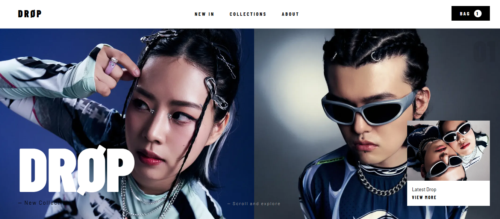
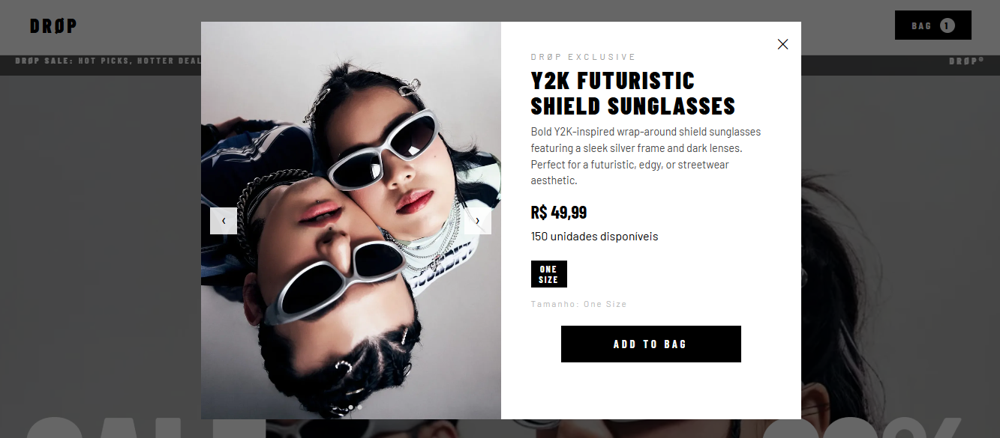
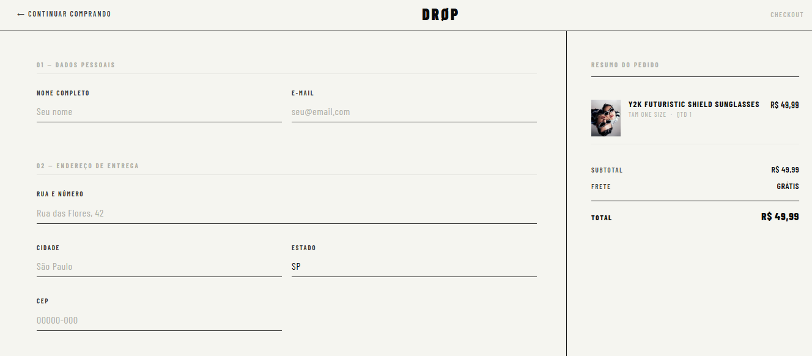

# DRØP — E-Commerce Front-End & UI Design

<br>
 
> A **DRØP** é um ensaio de design de interface e e-commerce voltado para a cultura streetwear. A plataforma foi concebida para unir tipografia expressiva, atitude estética e uma experiência de navegação totalmente imersiva.

<br>

## 🚀 Sobre o Projeto

Nascida da intersecção entre design urbano e desenvolvimento Front-End, a aplicação foi estruturada para demonstrar a criação de vitrines virtuais focadas em performance, transições fluidas e diagramação editorial limpa. 

O projeto conta com uma identidade visual forte (limites nítidos, tipografia *Barlow Condensed* e contraste P&B) e fluxos de navegação completos.

---

## 🖼️ Galeria do Projeto

<div align="center">
  <h3>Vitrine Inicial</h3>
  
  <br><br>
  <h3>Catálogo de Coleções</h3>
  
  <br><br>
  <h3>Finalização de Compras</h3>
  
</div>
---

## 🛠️ Tecnologias e Ferramentas Utilizadas

A estruturação desta interface e a sua arquitetura de apoio contaram com as seguintes tecnologias:

* **Front-End:** HTML5, CSS3, Vanilla JavaScript (sem frameworks, puro domínio da DOM).
* **Back-End (Arquitetura de Apoio):** FastAPI (Python).
* **Banco de Dados:** Firebase Firestore.
* **Assets / Imagens:** Unsplash.
* **Inspiração Visual / UI:** Pinterest.

---

## 📂 Estrutura de Ficheiros

```bash
drop-ecommerce/
│
├── assets/               # Imagens do projeto (view1.png, view2.png, view3.png)
├── frontend/
│   ├── assets/           # Imagens editoriais, fotos de produtos e favicon
│   ├── css/              # Folhas de estilo / variáveis do projeto
│   ├── app.js            # Lógica principal (carrinho, fetch de produtos, modais)
│   ├── index.html        # Página inicial (Hero e Seção New In / Bastidores)
│   ├── collections.html  # Vitrine de produtos e categorias
│   ├── checkout.html     # Resumo do pedido e opções de pagamento simuladas
│   ├── about.html        # Manifesto e créditos da criadora
│   └── admin.html        # Painel de gerenciamento de categorias
│
├── .gitignore
├── README.md
└── ...
